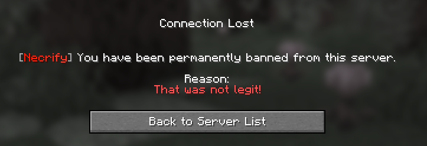
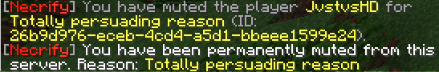
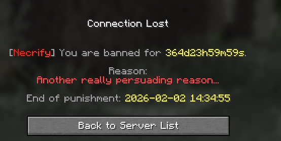
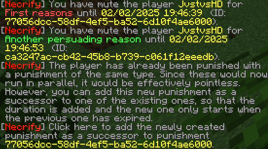
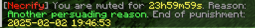
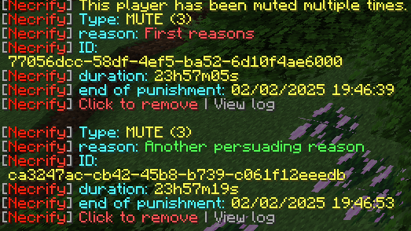
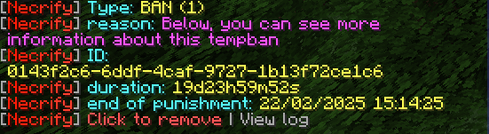
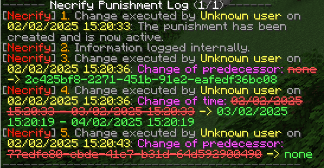
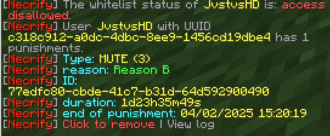

---
search:
  boost: 2
title: Necrify's commands
description: Commands of Necrify with detailed information about each command.
---

# Necrify's commands
Necrify offers commands for all of its actions. This page provides detailed information about each command. 
Per default, all commands are registered with the prefix `/necrify`. Moreover, it is possible to register top-level commands too by
setting `allow-top-level-commands` to true (which is the default). This does not apply to the commands /necrify user and /necrify punishment.

## Legend
### Arguments
- `<arg>` denotes a required argument
- `[arg]` denotes an optional argument
- `player` as argument name means a player name OR uuid is required
- `reason` means a reason that supports [MiniMessage](https://docs.advntr.dev/minimessage/format.html)
- `duration` as argument name means a [duration](#duration)
- `punishment id` means the id of a punishment (UUID)
- `--flag flag_value` denotes a flag with a value. These are always optional

### Duration
For temporal punishments, a duration must be specified. To be parsed by `PunishmentDuration#parse(String)`, a string must follow this scheme:
`[n][s, m, h, d]` where `n` in the first bracket is a natural number and the second bracket denotes the unit of time:
`s` - second(s), `m` - minute(s), `h` - hour(s), `d` - day(s).

These values can be composed, all of them can be omitted. You can preview the expiration when hovering over the auto-completion.
!!! example "Examples"
    - `1d12h15m30s` means a duration of 1 day, 12 hours, 15 minutes, and 30 seconds. 
    - `1d` means a duration of 1 day.
    - `1h30m` means a duration of 1 hour and 30 minutes.

## Command overview
Every command can only be executed by players with the permission `necrify.command.<command>` or `necrify.admin` for all functions.
### ban
**Usage:** `/necrify ban <player> [reason]`

This command bans a player permanently for the given reason or the default reason if no reason is specified.
??? example "Example command"
    - `/necrify ban Notch` bans the player Notch permanently.
    - `/necrify ban Notch Cheating` bans the player Notch permanently due to cheating.

### mute
**Usage:** `/necrify mute <player> [reason]`

This command mutes a player permanently for the given reason or the default reason if no reason is specified.
??? example "Example command"
    - `/necrify mute Notch` mutes the player Notch permanently.
    - `/necrify mute Notch Spamming` mutes the player Notch permanently due to spamming.

### kick
**Usage:** `/necrify kick <player> [reason]`

This command kicks a player from the server for the given reason or the default reason if no reason is specified.
??? example "Example command"
    - `/necrify kick Notch` kicks the player Notch.
    - `/necrify kick Notch Cheating` kicks the player Notch due to cheating.

### tempban
**Usage:** `/necrify tempban <player> <duration> [reason]`

This command bans a player for the given duration for the given reason or the default reason if no reason is specified.
??? example "Example command"
    - `/necrify tempban Notch 30d` bans the player Notch for 30 days.
    - `/necrify tempban Notch 14d Cheating` bans the player Notch for 14 days due to cheating.
    - `/necrify tempban Notch 1d12h Cheating` bans the player Notch for 1 day and 12 hours due to cheating.

??? tip "Multiple tempbans"
    If a player is already banned and then banned again, you will be asked if you want to chain the bans. Moreover, you will
    get this option for every existing ban that is still active. If you choose to chain the bans, the new ban will be put
    in a sort of idle state and only gets activated when the previous ban expires. This way, the player will be banned for
    the sum of all durations. If you choose not to chain the bans, the new ban will be applied immediately and run parallel
    to the existing ban(s): 
    

### tempmute
**Usage:** `/necrify tempmute <player> <duration> [reason]`

This command mutes a player for the given duration for the given reason or the default reason if no reason is specified.
??? example "Example command"
    - `/necrify tempmute Notch 30d` mutes the player Notch for 30 days.
    - `/necrify tempmute Notch 14d Spamming` mutes the player Notch for 14 days due to spamming.
    - `/necrify tempmute Notch 1d12h Spamming` mutes the player Notch for 1 day and 12 hours due to spamming.

??? tip "Multiple tempmutes"
    Like bans, if a player is already muted and then muted again, you will be asked if you want to chain the mutes. Moreover, you will
    get this option for every existing mute that is still active. If you choose to chain the mutes, the new mute will be put
    in a sort of idle state and only gets activated when the previous mute expires. This way, the player will be muted for
    the sum of all durations. If you choose not to chain the mutes, the new mute will be applied immediately and run parallel
    to the existing mute(s): 
    

### unban
**Usage:** `/necrify unban <player>`

This command unbans the given player. If multiple bans exist for the player, you will be asked which one you want to remove.
??? example "Example command"
    - `/necrify unban Notch` unbans the player Notch.

??? example "When multiple bans exist"
    

### unmute
**Usage:** `/necrify unmute <player>`

This command unmutes the given player. If multiple mutes exist for the player, you will be asked which one you want to remove.
??? example "Example command"
    - `/necrify unmute Notch` unmutes the player Notch.

??? example "When multiple mutes exist"
    

### punishment
**Usage:** `/necrify punishment <punishment id> <cancel|remove|change|info|chain|log> --chain other_punishment --page log_page`

This command manages punishments. The following subcommands are available:

- ==cancel== or ==remove== cancel the punishment just like the `unban` and `unmute` commands, but regardless of the punishment type.
- :soon: ==change== changes the reason and/or duration of the punishment.
- ==info== shows information about the punishment. You can still view this info after the punishment has expired, but you cannot cancel it anymore
  and there will be no data about the punishment type:
  
- ==chain== allows you to chain the punishment with another one. By doing this, one punishment gets put in an idle state 
  and only gets activated when the other one expires. You have to use this in combination with the `--chain` flag to provide the
  punishment id of the other punishment. 
  This command will fail if:

    * the two punishments' types are not compatible (e.g. you cannot chain a ban with a mute) 
    * the two punishments' users are not the same
    * this chaining would create some sort of circular dependency (e.g. punishment B succeeds punishment A, now chaining C 
      with B so that C succeeds B (and A) is ok, but letting C succeed A would create a circular dependency)

- ==log== shows the log of the punishment. You can use the `--page` flag to specify the page of the log you want to see.
  This flag will also get used by the paginator appearing if you run this commands. Log data will be shown in the style of
  {--old value--} -> {++new value++}:
  

??? example "Example commands"
    - `/necrify punishment 12345678-1234-1234-1234-123456789abc info` shows information about the punishment
    - `/necrify punishment 12345678-1234-1234-1234-123456789abc cancel` cancels the punishment
    - `/necrify punishment 12345678-1234-1234-1234-123456789abc chain --chain 87654321-4321-4321-4321-432109876543` chains the punishment with another one
    - `/necrify punishment 12345678-1234-1234-1234-123456789abc log --page 2` shows the second page of the punishment log

### user
**Usage:** `/necrify user <player> <info|delete|whitelist>`

This command is used to manage the users Necrify knows. The following subcommands are available:

- ==info== shows information about a player's punishments and his whitelist status. 
  Note: something caused the English message to not display the whitelist status correctly. This will be fixed in the next update.
  
- ==delete== deletes this user including all punishments.
- ==whitelist== inverts the whitelist status of the player. If the player is whitelisted, he will be blacklisted and vice versa.

??? example "Example commands"
    - `/necrify user Notch info` shows information about the player Notch
    - `/necrify user Notch delete` deletes the player Notch including all punishments
    - `/necrify user Notch whitelist` inverts the whitelist status of the player Notch

### reload
**Usage:** `/necrify reload`

This command reloads the plugin's configuration. This is useful if you want to apply changes to the configuration without 
restarting the server like changing the default reason for bans and mutes or (de)activating the whitelist. If the reload fails,
you will get a message in the console but the plugin will still work with the old configuration until the next restart.

### whitelist
**Usage:** `/necrify whitelist [status|on|off]`

This command shows the current whitelist status or changes it. {--If you want to change the status, you can use `on` to enable the whitelist
or `off` to disable it.--}}If you want to see the status, you can use `status`. `on` and `off` are currently suspended.
You currently need to change `whitelist-activated` in the configuration file to enable or disable the whitelist and then reload
the plugin.

??? example "Example commands"
    - `/necrify whitelist status` shows the current whitelist status
    - {--`/necrify whitelist on` enables the whitelist--} currently suspended
    - {--`/necrify whitelist off` disables the whitelist--} currently suspended

### createtemplate
**Usage:** `/necrify createtemplate <template_name>`
This command creates a new template. A template is a set of stages designed for handling recurring punishments, such as 
cheating or chat misuse. For every new rule break, the next stage is applied, which results in more rigid punishments the
next time (you can, of course, add a later stage with a punishment with lesser duration).

??? example "Example command"
    `/necrify createtemplate cheating`

### template
This command is used to manage and view templates and stages. The following sub-commands exist:

- template <template\> ==info==: shows template stages
- template <template\> ==delete==: deletes the template
- !!! tip inline end "Creation of stages"
    in a future release, this command will get replaced with a creation wizard where you can type in all needed values
  template <template\> ==addstage== <duration\> <type\> <reason\>: adds a new stage to the template that will apply a punishment
  of the given type (all available types will be shown) while using the given [duration](#duration)
- template <template\> ==remove== <index\>: removes the specified stage (index is visible through the info command) from this template
- template <template\> ==apply== <user\>: Applies the punishment of the user's current stage
- template <template\> ==amnesty== <target\>: Amnesties the target user regarding the template. This means, the current stage this user
  is at will be reset. Through `--to <number>`, you can specify the stage to which this should be reset, whereas 0 is a total reset
  and, for example, 1 means, that the next stage applied is stage 2. Against this command's name, this can also be used to increase
  the current stage of this user regarding the specified template.
- template <template\> ==state== <target\>: Displays the stage last applied to this user and the next stage to be applied

Last version of this page: according to plugin version 1.2.3