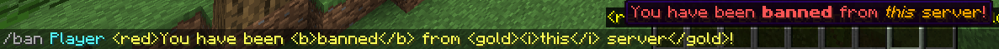
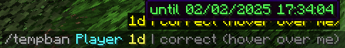

---
search:
  boost: 2
title: Welcome to Necrify
description: Home page of Necrify with general information about the plugin.
---

# Necrify

Necrify is a Minecraft plugin designed for currently[Velocity](https://velocitypowered.com) (and
maybe [Paper + Fabric in the future](https://github.com/users/JvstvsHD/projects/5)). It comprises many ways to manage punishments for server users such as bans and mutes
and is currently translated for English and German. It also has capabilities for whitelist management.<br>

## Why Necrify?

Necrify offers many easy-to-use commands with great auto-completion. If you want to style your reasons, you can use the
[MiniMessage](https://docs.advntr.dev/minimessage/format.html) format (You can try this
out [here](https://webui.advntr.dev)):


///caption
You can preview reasons when hovering over the auto-completion
///

The same applies for durations. Here, Necrify tells you when you're duration is not correct. More about that on 
the [commands page](commands.md#duration):

{ align=left }
{ align=right }
///caption
///

Moreover, Necrify has a great API for developers to use. You can find more about that on the [API usage page](api-usage.md).

## Plugin installation

1. [Download the latest version of the plugin](https://hangar.papermc.io/JvstvsHD/Necrify/versions) or download dev
   builds [here](https://ci.jvstvshd.de/job/Necrify/) (may be unstable or not working)
2. Put the downloaded file into the ```plugins``` folder of your server.
3. (Re-)Start the server.

!!! warning "Snapshot builds"
    Snapshot builds are not stable and may contain bugs. They are not recommended for production use. Use them at
    your own risk and only for testing purposes.

## Mutes on Velocity
!!! bug "Mutes on Velocity"
    TL;DR: Mutes are not working on Velocity anymore due to the 1.19.1 update. To still mute players,
    install the paper plugin on all of your paper servers.


With the 1.19.1 Minecraft update, Minecraft's chat system got
changed ([detailed explanation](https://gist.github.com/kennytv/ed783dd244ca0321bbd882c347892874)).
Since then, it is no longer possible to block chat messages in the ChatEvent of Velocity due to the signed chat
messages.
This is why the chat listener does not block any messages anymore which means mutes are effectively useless. A solution
to this problem is developing an extension plugin for the actual game servers where cancelling these messages is still
possible. Downloads for this paper plugin are found in
the [releases](https://github.com/JvstvsHD/necrify/releases/latest) and also
as [dev builds](https://ci.jvstvshd.de/job/Necrify/) on Jenkins.<br>
For further information about 1.19.1, please refer to
the [official release notes](https://www.minecraft.net/en-us/article/minecraft-java-edition-1-19-1)